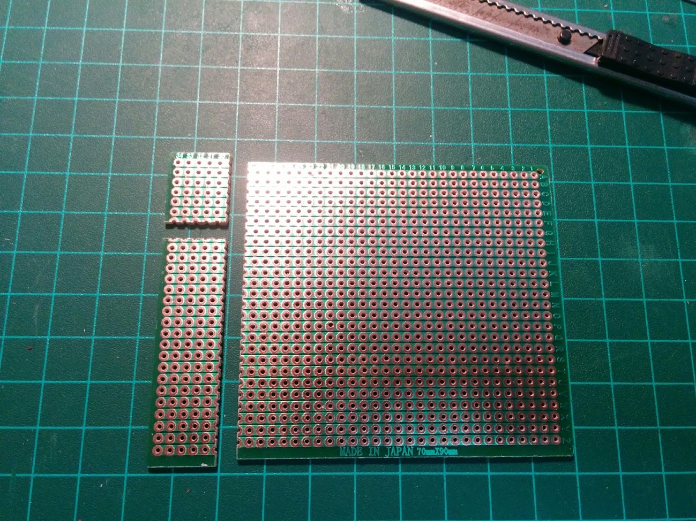
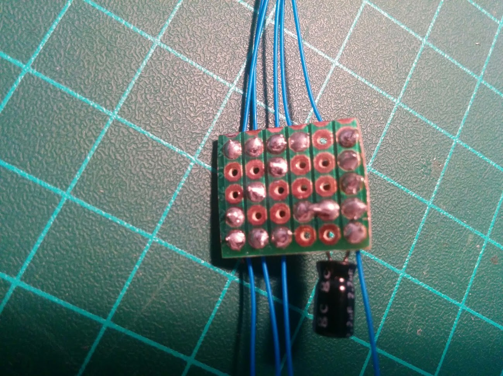
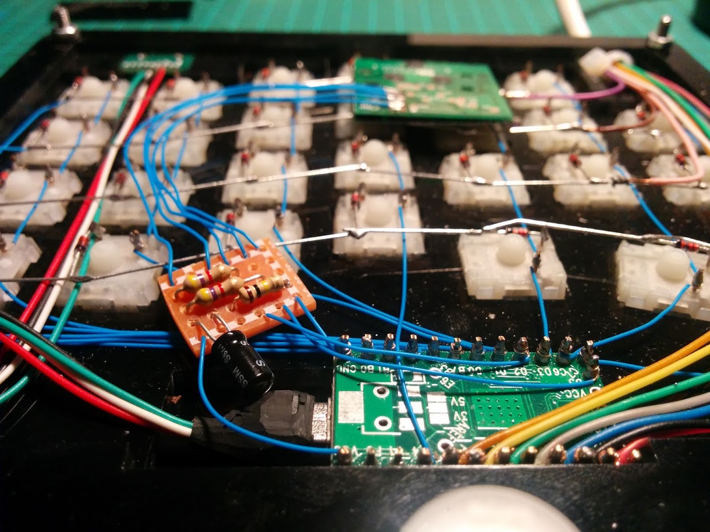

# Trackpoint: step by step

## Target audience

- hard to cover every use-case
- limited to hand-wired, teensy, tmk, mousekeys
- still useful for others

## FAQ

### Q: What should I use for the trackpoint stem/stick?

labret cheek piercing (16G)

- cheap
- strong
- thin diameter
- different lengths
- flat bottom (gluing)
- screw on top ball

### Q: How do I identify the trackpoint pinout?

**With some luck, or a multimeter and a steady hand.**
(A scope would be better, but unfortunately I don't have one).

If you're lucky, someone has already identified the pinout of the
trackpoint you have (see [pinouts][pinouts]), or at least a similar one.

If not, you'll need to identify the pinout yourself, here are some tips:

- The largest tracer is most likely GND.
- The second largest tracer is most likely VCC.
- Using a multimeter and the PTPM754 [datasheet][datasheets], test for
  connectivity:

```
CLK (INT0)    - PTPM754 pin 24
DATA (TXD/1)  - PTPM754 pin 2
RST           - PTPM754 pin 5
GND           - PTPM754 pin 8
VCC           - PTPM754 pin 22
```

- Alternatively, if you have a scope and know what you're doing:

```
CLK  - should have a frequency reading
DATA - should have a 5V reading
RST  - should have a 0V reading
```

## What you need

## Steps

### 1. Solder leads to trackpoint

- 5 leads
- tin pads
- helping hand to heat leads

### 2. Create the reset circuit (RC)

- What you need:

    - 4.7k resistors x2
    - 100k resistor
    - 2.2uF capacitor
    - Veroboard
    - Cutting knife (x-acto, nt-cutter, japanese knife, etc.)
    - Sandpaper
    - Soldering equipment
    - Insulation tape

- Cut a piece of veroboard (6x5 - the 5 is for rails)

    - Using the cutting knife, perform 5-10 cuts on both sides.
    - Using a little pressure, snap the board on the cut.
    - Use sandpaper to smooth out the cut edges.



- Place the components on the veroboard, and solder

    - Resistors

        - Resistors don't have polarity, no need to worry.
        - Bend component legs, insert into veroboard.
        - On the back-side, slightly bend legs so components stay in position.
        - Use insulation tape to hold resistors in position if needed.
        - Snip legs (leaving about 3-5mm) and solder.
        - Snip the protruding legs for extra clearance.

    - Capacitor

        - Capacitors have polarity, usually marked with a minus (negative).
        - Positive leg must go in the VCC rail.
        - Insert capacitor legs partially, so it can be bent off the
          veroboard for clearance inside the keyboard case.
        - On the back-side, bend legs slightly so it stays in position.
        - Use insulation tape to hold capacitor in position.
        - Snip legs and bend negative over to 100k resistor pad, and solder.
        - Snip the protruding leg for extra clearance.


### 3. Solder leads to reset circuit (RC)

- What you need:

    - Thin wire (I used wire wrap 30 guage wire).
    - Wire cutter and stripper.
    - Soldering equipment.
    - Bonus: helping hand.

- Solder trackpoint leads to reset circuit.
- Cut, strip and solder leads to reset circuit that will go to the teensy.



### 4. Testing on a breadboard

- usart firmware
- connect, flash, test

### 5. Make trackpoint stem hole in case

- 1.2mm hole
- pcb drill, thin rounded file

- locate position, scratch
- make hole
- test diameter

### 6. Make space for trackpoint in keyboard

- insulation tape (shorts, protection)
- rewiring rows/columns for clearance
- trim switch legs
- relocate d2 d5

### 7. Test trackpoint clearance and stem length, glue stem

- double side tape, test stems
- rinse repeat
- glue

### 8. Solder reset circuit (RC) to teensy

- Solder leads to teensy:

```
VCC  -> teensy VCC
GND  -> teensy GND
CLK  -> teensy D5
DATA -> teensy D2
```



### 9. Finish up

- verify position, close, screw on ball

### 10. Update tmk_keyboard firmware and flash

- usart update

## TMK firmware changes and tweaks

- usart support diff
- mousekeys reference
- concurrent tp movement and mousekeys
- polling interval delay (dropped key stokes)
- auto-enable mouse layer on tp movement


[pinouts]: ./pinouts/
[datasheets]: ./datasheets/

